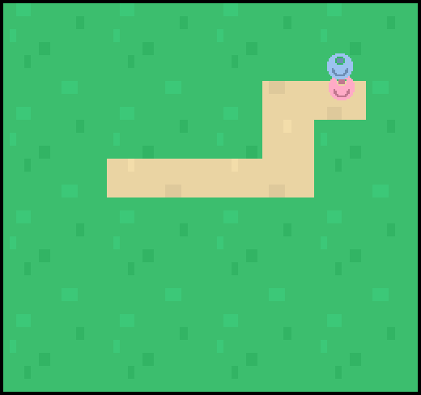

# Hide And Seek

Author: YC

Design:

- Your friend hide himself in the grass. You can cut the grass to find him. The grass grows very fast so you'll need to remember the positions.

Screen Shot:

How Your Asset Pipeline Works:

- Read png with python.
- Find the 3 colors that are used most frequently in the png file.
- Re-draw and encode the png with the 3 colors.
- Output the tiles and palettes to the asset files.
- Load assets at runtime.

How To Play:

- Arrow keys to control the walking directions
- Space key to cut the grass
- Win when your friend is found

Cheat the game:

- The position of the target gets printed in the terminal with an index to the grids
- The grids indexed from left-bottom to right-top are composed of 10 rows and 8 cols

Sources: 

- Grass/Sand tiles from: https://kenney.nl/assets/topdown-tanks-redux (**License:** ([CC0 1.0 Universal](https://creativecommons.org/publicdomain/zero/1.0/)))
- Player tiles from: https://kenney.nl/assets/platformer-art-deluxe (**License:** ([CC0 1.0 Universal](https://creativecommons.org/publicdomain/zero/1.0/)))

This game was built with [NEST](NEST.md).

